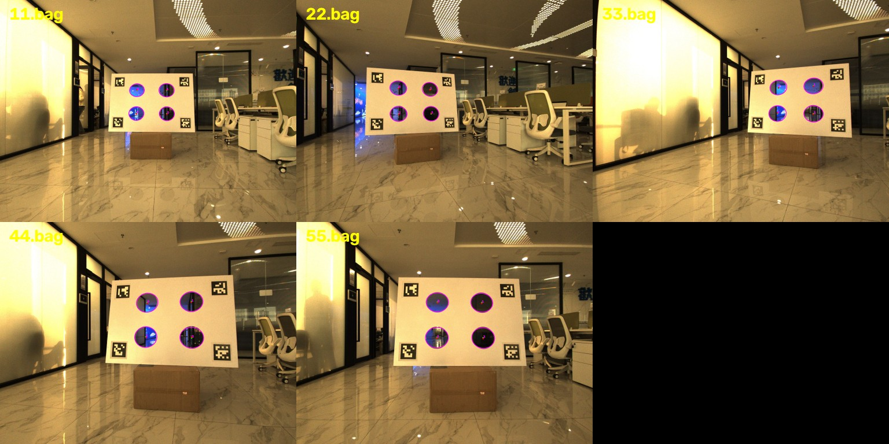

# Circular-Center Calibration for ROS

An independent ROS 1 integration of the circular-center estimators released in
[`xiahaa/circular-center-calibration`](https://github.com/xiahaa/circular-center-calibration).
It estimates a LiDAR-to-camera extrinsic transform from a planar target containing
circular holes.

## What is included

- An image node that rectifies incoming images, fits OpenCV ellipses, and calls the
  released perspective-aware 2D circular-center estimator.
- A LiDAR node that fits the target plane, detects circular holes in a plane
  occupancy map, and calls the released robust 3D circle fitter.
- A calibration server that synchronizes the two observations, resolves the two
  possible projected centers, optionally resolves circle ordering independently in
  every frame, estimates `T_camera_lidar`, and publishes ROS messages and TF.
- An offline YAML workflow for deterministic experiments and regression tests.

`T_camera_lidar` maps a point expressed in the LiDAR frame into the camera frame:

```text
p_camera = T_camera_lidar * p_lidar
```

The TF parent is the camera frame and the TF child is the LiDAR frame.

## Requirements

- Ubuntu 20.04 and ROS Noetic
- Python 3.8+
- OpenCV, NumPy, and PyYAML
- [`circular-center-calibration` v0.1.0](https://github.com/xiahaa/circular-center-calibration/releases/tag/v0.1.0)

Install into a catkin workspace:

```bash
cd ~/catkin_ws/src
git clone https://github.com/xiahaa/circular-center-calibration-ros.git
cd circular-center-calibration-ros
python3 -m pip install --user -r requirements.txt

cd ~/catkin_ws
rosdep install --from-paths src --ignore-src -r -y
catkin_make
source devel/setup.bash
```

The Python dependency is pinned to the public `v0.1.0` core release. If a virtual
environment is used, make sure ROS can import packages from it.

## Online calibration

Copy and tune `config/default.yaml`, especially the LiDAR ROI, hole-radius range,
circle diameter, count, and image threshold settings. Then launch:

```bash
roslaunch circular_center_calibration_ros online.launch \
  config:=/absolute/path/to/my_target.yaml \
  image:=/camera/image_raw \
  camera_info:=/camera/camera_info \
  points:=/points_raw
```

Useful outputs and controls:

| Interface | Default name | Purpose |
| --- | --- | --- |
| Image candidates | `/projected_circle_centers` | Two possible 2D centers per ellipse |
| Debug image | `/projected_circle_centers/debug` | Ellipses and both candidate centers |
| LiDAR centers | `/lidar_circle_centers` | Fitted 3D hole centers |
| Result | `/calibration_result` | Transform, RMSE, inlier count, selected candidates |
| Solve service | `/circular_center_calibration/solve` | Solve from collected frames |
| Reset service | `/circular_center_calibration/reset` | Clear collected observations |

The default configuration waits for three synchronized target poses. Move the
target through the joint camera/LiDAR field of view, vary its depth and orientation,
inspect the debug image, then call the solve service if `auto_solve` is disabled:

```bash
rosservice call /circular_center_calibration/solve
```

Set `solver/output_path` in the configuration to persist the result as YAML.

### FAST-Calib Avia sample data

[`config/fastcalib_avia.yaml`](config/fastcalib_avia.yaml) contains the camera,
target, ROI, and topic settings for the released four-hole Avia sample. It reads
the compressed image topic directly, uses the four `DICT_6X6_50` corner markers to
guide ellipse fitting, and accumulates five Livox frames before detecting holes:

```bash
roslaunch circular_center_calibration_ros online.launch \
  config:=$(rospack find circular_center_calibration_ros)/config/fastcalib_avia.yaml \
  image:=/left_camera/image/compressed \
  points:=/livox/lidar

rosbag play 11.bag
```

One static recording contributes one target pose; redundant frames are rejected by
translation and plane-normal thresholds. Keep the calibration server running and
play recordings from multiple target poses before solving. The five-frame point
cloud window assumes the sensor and target remain still for roughly half a second.
Set `accumulation_frames: 1` for dense spinning-LiDAR scans or moving targets.

The same five bags can be evaluated without a ROS installation using
[`tools/evaluate_fastcalib_avia.py`](tools/evaluate_fastcalib_avia.py) and
`rosbags`:

```bash
python3 -m pip install -r requirements-evaluation.txt
PYTHONPATH=src python3 tools/evaluate_fastcalib_avia.py /path/to/avia \
  --output outputs/avia/result.yaml \
  --debug-directory outputs/avia/debug
```

The evaluator extracts one observation per numbered bag, writes annotated images,
runs the same detectors and solver, and compares against the reference `Rcl/Pcl`
stored in the sample camera YAML. The reference transform is never used as a solver
input.

On the five sample recordings (`11.bag` through `55.bag`), the current configuration
detects four image circles and four LiDAR circles in every recording. The joint solve
has a 1.443 px RMSE over 9/20 inliers at the configured 4 px threshold; its transform
differs from the sample FAST-Calib result by 0.190 degrees and 0.0229 m. These are
differences between two calibration outputs, not ground-truth accuracy. The modest
inlier ratio also indicates that LiDAR boundary extraction still needs improvement.

The image below shows the detections from all five recordings. Magenta curves are
the fitted ellipses; green and red dots are the two perspective-aware projected
center candidates.



### Circle identities

Detector IDs are local geometric orderings, not physical marker identities. Plane
basis directions can flip, so online calibration enables per-frame correspondence
resolution by default. `maximum_permutation_size` limits factorial search and is
six by default. For targets with more circles, publish stable physical IDs or
disable automatic ordering and supply explicit correspondences offline.

Four circles are the mathematical minimum, but a symmetric four-hole target can
have ambiguous single-frame permutations. Use multiple target poses; five or six
asymmetrically placed holes are preferable when the target can be redesigned.

## Offline calibration

The input schema is illustrated by
[`examples/synthetic_problem.yaml`](examples/synthetic_problem.yaml). Each 3D point
has two corresponding 2D candidates. IDs in this format are explicit, so ordering
resolution is disabled unless requested.

```bash
roslaunch circular_center_calibration_ros offline.launch \
  input:=$(rospack find circular_center_calibration_ros)/examples/synthetic_problem.yaml \
  output:=/tmp/circular_center_result.yaml \
  publish_tf:=false
```

The result records the transform convention, matrix, translation, quaternion,
reprojection RMSE, inliers, selected binary candidate, and resolved correspondence
index for every observation.

## Validation

Run the pure-Python regression tests:

```bash
python3 -m pip install --user -r requirements-dev.txt
python3 -m pytest -q
ruff check .
```

For a complete ROS build and test:

```bash
cd ~/catkin_ws
catkin_make
catkin_make run_tests_circular_center_calibration_ros
catkin_test_results
```

Tests cover binary center disambiguation, unlabelled per-frame ordering, YAML I/O,
synthetic image ellipses, and synthetic LiDAR circular holes.

## Citation and license

If this software contributes to published work, cite the paper described in
[`CITATION.cff`](CITATION.cff) and the core implementation. Code in this repository
is Apache-2.0 licensed. See [`THIRD_PARTY_NOTICES.md`](THIRD_PARTY_NOTICES.md) for
dependency and provenance details.
